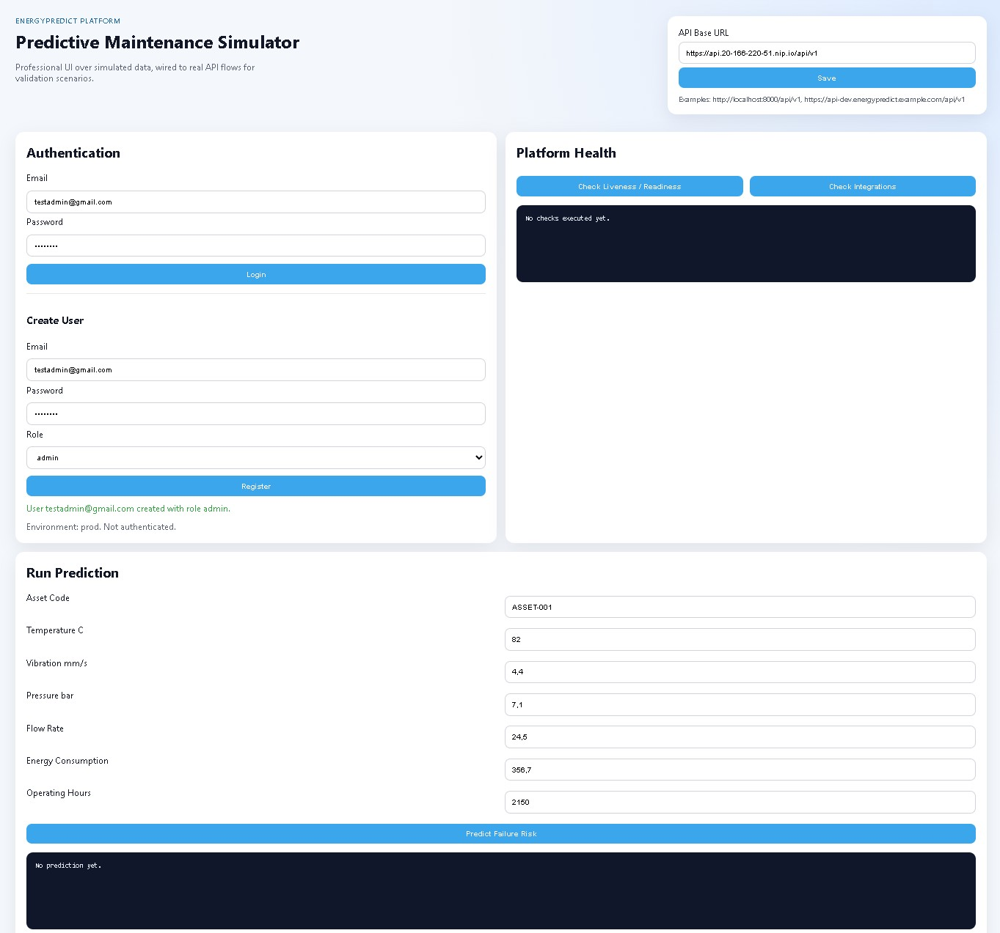

# EnergyPredict MLOps API

Backend para mantenimiento predictivo industrial con FastAPI, MLOps y despliegue en Kubernetes (AKS-ready).

## Highlights
- FastAPI + OpenAPI.
- Auth JWT + RBAC por roles.
- Prediccion online (`/api/v1/predict`).
- Training endpoint (`/api/v1/models/train`).
- SQLAlchemy + SQLite (MVP), listo para PostgreSQL.
- Docker (imagen para AKS).
- Kubernetes manifests (`k8s/base`, `k8s/overlays`).
- Portal web estatico para simulador (`frontend/simulator-portal`).
- Registro de usuarios desde UI del portal (consume `POST /api/v1/auth/register`).
- Middleware de trazabilidad HTTP (`trace_id`, metodo, ruta, status, latencia, user, role).
- CI/CD en Azure DevOps:
  - `azure-pipelines-infra.yml`
  - `azure-pipelines-app.yml`
  - `azure-pipelines-frontend.yml`
- Variable Group `energypredict-shared` gestionable como codigo (`infra/terraform/devops`).
- Suite de tests automatizados.

## Visual Walkthrough
Estas capturas muestran el comportamiento real del proyecto en ejecucion.

### 1. Product UI
Portal del simulador predictivo en Azure Static Web Apps (sin datos cargados en esta vista inicial).



### 2. API Health and Runtime Status
Verificacion de health checks del backend (`live` / `ready`) y estado operativo correcto.


### 3. Azure DevOps CI/CD Overview
Vista general de ejecucion de pipelines para infra, backend y frontend.


Pipeline de backend (app) con fases de validacion y despliegue.


Validacion de seguridad de dependencias en CI (dependency audit).


Pipeline de frontend (vista general de despliegue).


Pipeline de frontend (detalle del job de deploy).


### 4. AKS and Kubernetes Operations
Estado del deployment y replicas en AKS.


Relacion entre Service, Endpoints y Pods en namespace de aplicacion.


Detalle de un pod para diagnostico operativo.


Eventos del pod para troubleshooting (scheduling, mounts, pulls, etc.).


Metricas de escalado y consumo (`HPA` / `kubectl top`).


### 5. Data Layer
Estado de Azure Database for PostgreSQL en portal Azure.


## AKS-First Quickstart
```powershell
cd infra/terraform/envs/dev
Copy-Item terraform.tfvars.example terraform.tfvars
terraform init
terraform plan -out tfplan
terraform apply tfplan
```

Backend and frontend deployment are managed through Azure DevOps pipelines (`infra`, `app`, `frontend`).

El pipeline de app prepara host publico del API en Ingress y el pipeline de frontend puede consumir ese host para publicar `config.js` con `API_BASE_URL` por entorno.

## Quick cleanup (cost control)
Para destruir los entornos desplegados y evitar costes fuera de horario:
```powershell
.\scripts\destroy_all.ps1
```

## CI/CD without tfvars in repo
Para ejecutar Terraform desde Azure DevOps sin subir `terraform.tfvars`, genera:
- `TFVARS_DEV_B64`
- `TFVARS_PROD_B64`

Comando:
```powershell
.\scripts\generate_tfvars_b64.ps1
```

## API Base Path
- `/api/v1`

## Key Endpoints
- `GET /health/live`
- `GET /health/ready`
- `POST /auth/register`
- `POST /auth/login`
- `GET /auth/me`
- `POST /predict`
- `GET /models/current`
- `POST /models/train`

## Documentation
- `docs/02_ARCHITECTURE.md`
- `docs/05_SECURITY_AUTH_ENCRYPTION.md`
- `docs/06_MLOPS_DATABRICKS_MLFLOW.md`
- `docs/07_AKS_PRODUCTION_CICD.md`
- `docs/09_FRONTEND_STATIC_SIMULATOR.md`
- `docs/14_SECURITY_HARDENING_PLAN.md`
- `docs/15_AKS_WORKLOAD_IDENTITY_KEYVAULT_CSI.md`
- `RUNBOOK_E2E_AZURE_DEVOPS.md`
- `CONTRIBUTING.md`
- `SECURITY.md`
- `CODE_OF_CONDUCT.md`

## Delivery Scope
### MVP implemented
API, auth, prediction, training flow, persistence, tests, containerization and AKS-ready artifacts.

### Production extension
Advanced security hardening, full observability, and managed enterprise integrations.


