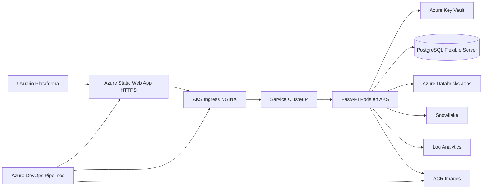

# 02 - Arquitectura

## Estado actual
Plataforma operativa con backend FastAPI, integraciones MLOps y despliegue cloud en Azure con separacion por entornos (`dev` / `prod`).

## Arquitectura objetivo/implementada

## Componentes por capa

### Presentacion
- Frontend estatico: `frontend/simulator-portal`.
- Hosting: Azure Static Web App con HTTPS gestionado.

### API y negocio
- FastAPI en AKS.
- Auth JWT + RBAC.
- Endpoints de salud (`/health/live`, `/health/ready`) y prediccion (`/predict`).

### Datos e integraciones
- PostgreSQL para persistencia operativa.
- Databricks para ejecuciones remotas de entrenamiento.
- Snowflake para capa analitica (configurable por secretos).

### Seguridad
- Secretos en Key Vault.
- Identidades gestionadas y permisos RBAC.
- No secretos reales en repo.

### Entrega continua
- `azure-pipelines-infra.yml`: Terraform (infra).
- `azure-pipelines-app.yml`: backend (CI + deploy AKS).
- `azure-pipelines-frontend.yml`: frontend (deploy Static Web App).

## MVP vs extension productiva

### MVP implementado
- Backend + k8s overlays + pipelines Azure DevOps.
- Terraform de plataforma (AKS/ACR/KV/Databricks/PostgreSQL/SWA).
- Portal web estatico para demo profesional.

### Extension productiva
- APIM delante de AKS.
- Key Vault CSI driver en pods.
- Observabilidad avanzada (trazas distribuidas y alertas SLO/SLA).
- Estrategias blue/green para API.
