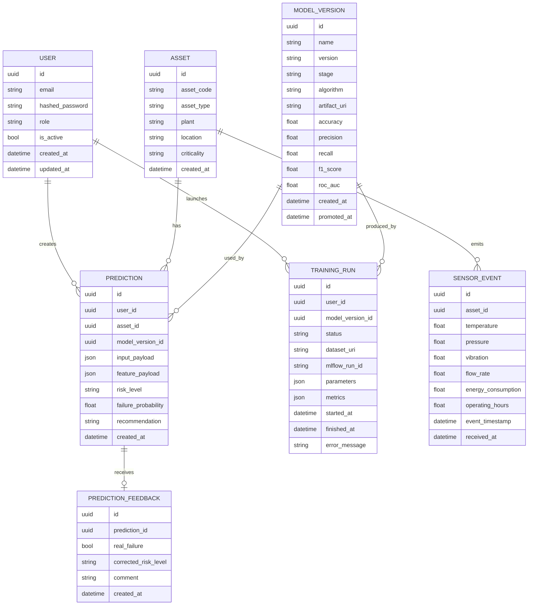

# 03 - Modelo de dominio y datos

## Objetivo

Definir entidades, relaciones y campos necesarios para explicar:

- Auth
- Roles
- Ingesta
- Inferencia
- Auditoría
- MLOps
- Feedback
- Model registry

## Entidades principales



## Tabla `users`

| Campo | Tipo | Requerido | Descripción |
|---|---|---:|---|
| `id` | UUID | sí | Identificador interno |
| `email` | string unique | sí | Login del usuario |
| `hashed_password` | string | sí | Password con hash, nunca texto plano |
| `role` | enum/string | sí | `admin`, `ml_engineer`, `analyst`, `consumer` |
| `is_active` | bool | sí | Permite desactivar usuarios |
| `created_at` | datetime | sí | Fecha creación |
| `updated_at` | datetime | sí | Fecha actualización |

Notas:

- No almacenar passwords en claro.
- Para demo se puede crear un usuario admin por seed.

## Tabla `assets`

Representa el activo industrial.

| Campo | Tipo | Ejemplo |
|---|---|---|
| `id` | UUID | `...` |
| `asset_code` | string unique | `PUMP-001` |
| `asset_type` | string | `pump` |
| `plant` | string | `refinery_a` |
| `location` | string | `unit_3` |
| `criticality` | enum | `low`, `medium`, `high` |
| `created_at` | datetime | `2026-05-16T10:00:00Z` |

## Tabla `sensor_events`

Guarda eventos de sensores crudos.

| Campo | Tipo | Descripción |
|---|---|---|
| `id` | UUID | Evento |
| `asset_id` | FK | Activo |
| `temperature` | float | Temperatura |
| `pressure` | float | Presión |
| `vibration` | float | Vibración |
| `flow_rate` | float | Caudal |
| `energy_consumption` | float | Consumo |
| `operating_hours` | float | Horas de operación |
| `event_timestamp` | datetime | Momento de medición |
| `received_at` | datetime | Momento de recepción por API |

Validaciones recomendadas:

- `temperature`: -50 a 250
- `pressure`: 0 a 500
- `vibration`: 0 a 50
- `flow_rate`: >= 0
- `energy_consumption`: >= 0
- `operating_hours`: >= 0

## Tabla `model_versions`

Representa una versión de modelo.

| Campo | Tipo | Descripción |
|---|---|---|
| `id` | UUID | ID interno |
| `name` | string | `asset_failure_classifier` |
| `version` | string | `1.0.0` |
| `stage` | enum | `staging`, `production`, `archived` |
| `algorithm` | string | `RandomForestClassifier` |
| `artifact_uri` | string | ruta local, MLflow URI o Databricks UC |
| `accuracy` | float | métrica |
| `precision` | float | métrica |
| `recall` | float | métrica |
| `f1_score` | float | métrica |
| `roc_auc` | float | métrica |
| `created_at` | datetime | creación |
| `promoted_at` | datetime nullable | promoción a prod |

Reglas:

- Solo debe haber un modelo `production` por nombre.
- No se promociona un modelo si no supera umbral mínimo.
- El modelo usado en predicción siempre se guarda.

## Tabla `training_runs`

Representa una ejecución de entrenamiento.

| Campo | Tipo | Descripción |
|---|---|---|
| `id` | UUID | ID interno |
| `user_id` | FK | Usuario que lanza |
| `model_version_id` | FK nullable | Modelo generado |
| `status` | enum | `pending`, `running`, `completed`, `failed` |
| `dataset_uri` | string | CSV, Snowflake query, Delta table |
| `mlflow_run_id` | string nullable | ID de MLflow |
| `parameters` | JSON | hiperparámetros |
| `metrics` | JSON | métricas |
| `started_at` | datetime | inicio |
| `finished_at` | datetime nullable | fin |
| `error_message` | string nullable | error |

## Tabla `predictions`

Guarda trazabilidad de inferencias.

| Campo | Tipo | Descripción |
|---|---|---|
| `id` | UUID | ID predicción |
| `user_id` | FK | Quién pidió |
| `asset_id` | FK nullable | Activo |
| `model_version_id` | FK | Modelo usado |
| `input_payload` | JSON | Payload original |
| `feature_payload` | JSON | Features calculadas |
| `risk_level` | enum | `low`, `medium`, `high` |
| `failure_probability` | float | 0 a 1 |
| `recommendation` | string | recomendación |
| `created_at` | datetime | fecha |

Frase de operacion:

> Cada predicción guarda la versión exacta del modelo, el input y el output. Esto permite auditoría, trazabilidad, análisis de drift y rollback.

## Tabla `prediction_feedback`

| Campo | Tipo | Descripción |
|---|---|---|
| `id` | UUID | ID feedback |
| `prediction_id` | FK | Predicción evaluada |
| `real_failure` | bool | Si ocurrió fallo real |
| `corrected_risk_level` | enum nullable | Corrección humana |
| `comment` | text | Observación |
| `created_at` | datetime | fecha |

Uso MLOps:

- Evaluar calidad real.
- Crear dataset de reentrenamiento.
- Medir drift.
- Mejorar modelo.

## Schemas Pydantic principales

### `SensorEventCreate`

```python
class SensorEventCreate(BaseModel):
    asset_code: str
    temperature: float = Field(..., ge=-50, le=250)
    pressure: float = Field(..., ge=0, le=500)
    vibration: float = Field(..., ge=0, le=50)
    flow_rate: float = Field(..., ge=0)
    energy_consumption: float = Field(..., ge=0)
    operating_hours: float = Field(..., ge=0)
    event_timestamp: datetime
```

### `PredictionRequest`

```python
class PredictionRequest(BaseModel):
    asset_code: str
    temperature: float
    pressure: float
    vibration: float
    flow_rate: float
    energy_consumption: float
    operating_hours: float
```

### `PredictionResponse`

```python
class PredictionResponse(BaseModel):
    prediction_id: UUID
    asset_code: str
    risk_level: Literal["low", "medium", "high"]
    failure_probability: float
    recommendation: str
    model_name: str
    model_version: str
    created_at: datetime
```

### `ModelVersionResponse`

```python
class ModelVersionResponse(BaseModel):
    id: UUID
    name: str
    version: str
    stage: Literal["staging", "production", "archived"]
    algorithm: str
    accuracy: float | None
    precision: float | None
    recall: float | None
    f1_score: float | None
    roc_auc: float | None
    created_at: datetime
```

## Dataset sintético recomendado

Columnas CSV:

```csv
asset_code,asset_type,plant,temperature,pressure,vibration,flow_rate,energy_consumption,operating_hours,failure_next_7_days
PUMP-001,pump,refinery_a,91.2,7.8,0.82,120.3,430.1,5020,1
PUMP-002,pump,refinery_a,67.5,5.1,0.23,151.0,390.5,2201,0
```

Target:

- `failure_next_7_days`: 0/1

Regla sintética posible:

```txt
Mayor riesgo si:
temperature > 85
pressure > 7
vibration > 0.7
operating_hours > 4000
energy_consumption alto
```

## Feature engineering mínimo

Features:

- `temperature`
- `pressure`
- `vibration`
- `flow_rate`
- `energy_consumption`
- `operating_hours`
- `temp_pressure_ratio`
- `vibration_per_hour`
- `energy_per_flow`

No complicar más.

## Índices recomendados

Para producción:

- `users.email`
- `assets.asset_code`
- `sensor_events.asset_id`
- `sensor_events.event_timestamp`
- `predictions.created_at`
- `predictions.model_version_id`
- `model_versions.name_stage`
- `training_runs.status`


